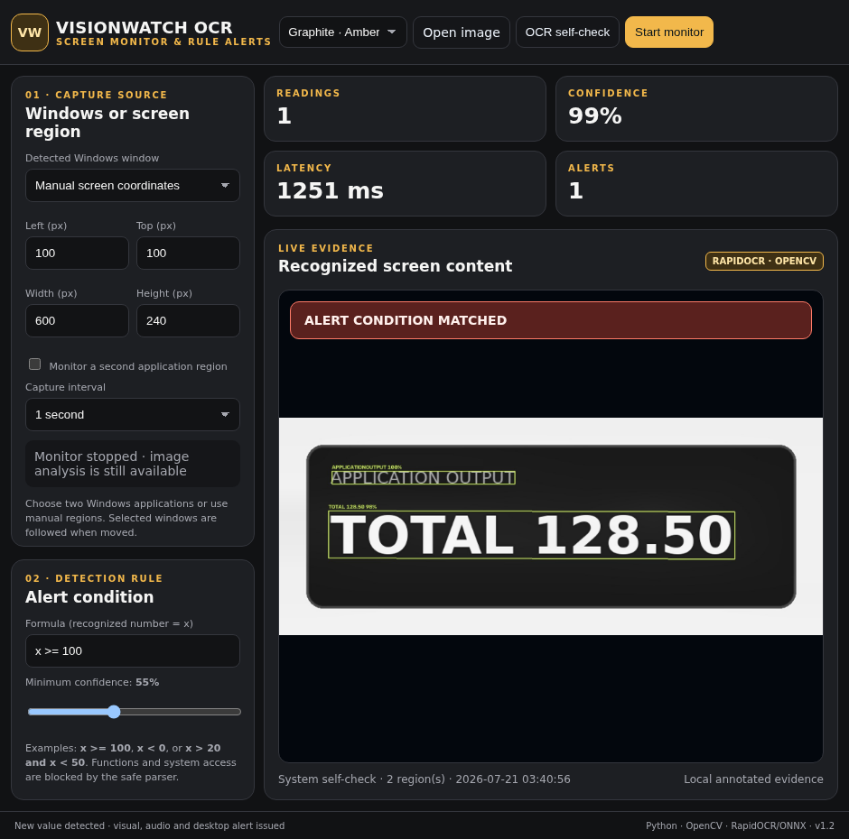

# VisionWatch OCR

VisionWatch monitors two Windows application windows, reads short text or
numbers locally and evaluates a configurable alert rule whenever fresh content
appears.



## What it demonstrates

- two independent window or screen-region sources;
- moving-window tracking during continuous capture;
- local OCR with confidence filtering and annotated evidence;
- a restricted mathematical rule language using the recognized value `x`;
- source-aware duplicate suppression;
- visual, audio and desktop notifications;
- persistent event history and CSV export;
- five themes with responsive full and half-screen layouts.

## Technology

- Python 3.11+;
- MSS for screen capture;
- OpenCV for scaling, denoising, CLAHE and evidence overlays;
- RapidOCR 3.8 with PP-OCRv4 ONNX models;
- ONNX Runtime for local CPU inference;
- pywebview with WebView2 on Windows.

The OCR self-check reads `TOTAL 128.50`, extracts `128.5`, evaluates
`x >= 100`, and records the detected regions and confidence score. Images do
not leave the device.

## Source included here

The public `src` package contains selected, testable components: safe formula
evaluation, fresh-reading classification and OpenCV preparation. The native
capture shell and customer-specific integration remain private. See
[PUBLIC_SOURCE_SCOPE.md](PUBLIC_SOURCE_SCOPE.md).

```bash
python -m venv .venv
. .venv/bin/activate
pip install -e .
python -m unittest discover -s tests -v
```

## Ownership

Copyright © 2026 Muhammet Sait Doğmuş. This is a portfolio source release; see
[LICENSE](LICENSE) before using any part of it.
